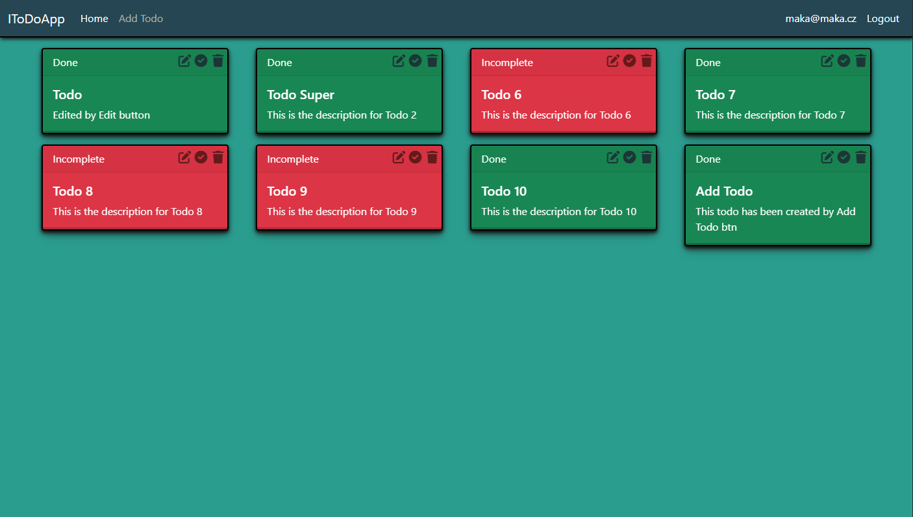

# TODO APP 
** using ASP.NET MVC + Identity **
* SQL DB
* Login, Register & TODO 

## Setup
TODO App requires NET 7.
> **Warning**  : First setup your connection string for your db in appsettings.json. 
```json 
  "ConnectionStrings": {
    "Default": "here_your_conn"
  }
```

## Preview
```
Preview
```

