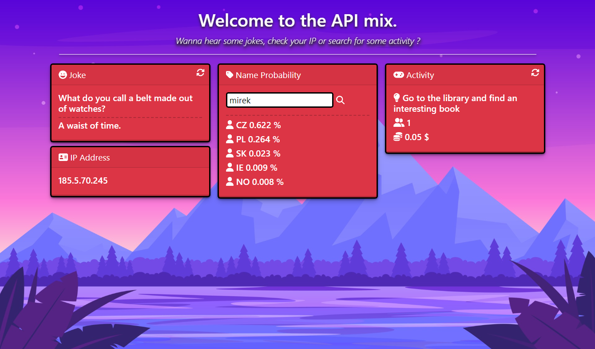

# API MIX
**Simple frontend app.**
_(No auth required)_

```git
TECH : TYPESCRIPT + REACT / VITE
```
> __Note__ : **Node.js 16+ required**

- Jokes
- IP Address
- Name Probability
- Activity


# Setup
```sh
npm i
npm run dev
```
Then open url which will be printed in the console (ex: http://127.0.0.1:5173/)

## Preview
```
MAIN PAGE
```

