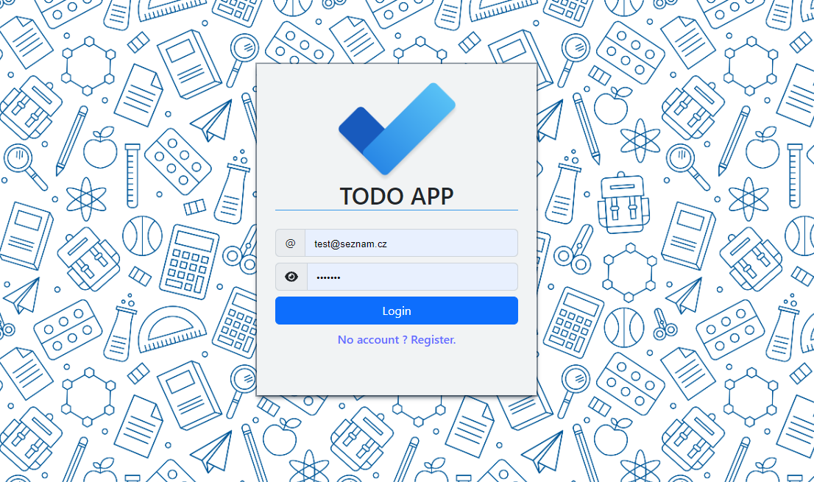
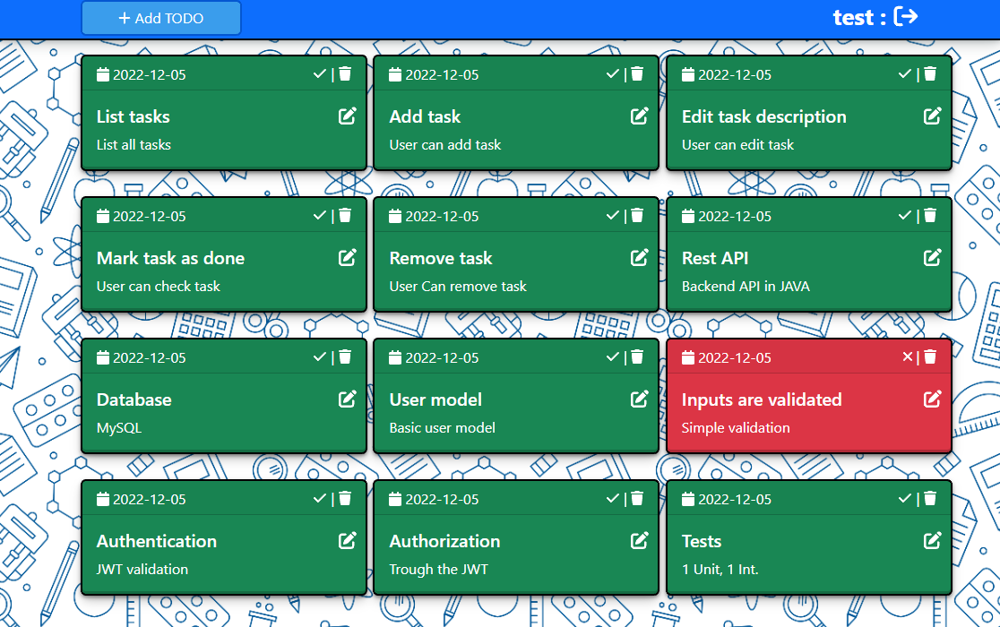

# TODO APP 
**Simple web app (Frontend + Backend)**
* JWT Authentication & Authorization
* 1 Unit and Integration Test
* MySQL Database
* Rest API
* Login, Register & TODO 

## Setup
TODO App requires [Node.js](https://nodejs.org/) v16+ to run.
> **Warning**  : First setup MySQL database and then edit application.properties. 
```sh 
	# EDIT THOSE PROPS.
	spring.datasource.url= 
	spring.datasource.username=root
	spring.datasource.password=password
```

> **Note**  : On the Backend side, ENV file is optional. 

> **Note**  : Fronted communicate trough the axios on "http://localhost:8080/api" *(./utils/Api.tsx)*

> **Note**  : Backend has DB initialization with this user and few test todos.
>  `` email : test@seznam.cz, password: 1234567``


# Frontend
```sh
npm i
npm run dev
```
Then open url which will be printed in the console (ex: http://127.0.0.1:5173/)

# Backend
```sh
run TodoAppApplication.main()
```
or
```sh
./gradlew bootRun
```
## Stack

| Part | Tech|
| ------ | ------ |
| Frontend| TypeScript, React / Vite |
| Backend| Java, Spring Boot |

## Preview
```
LOGIN
```

```
TODOS
```

